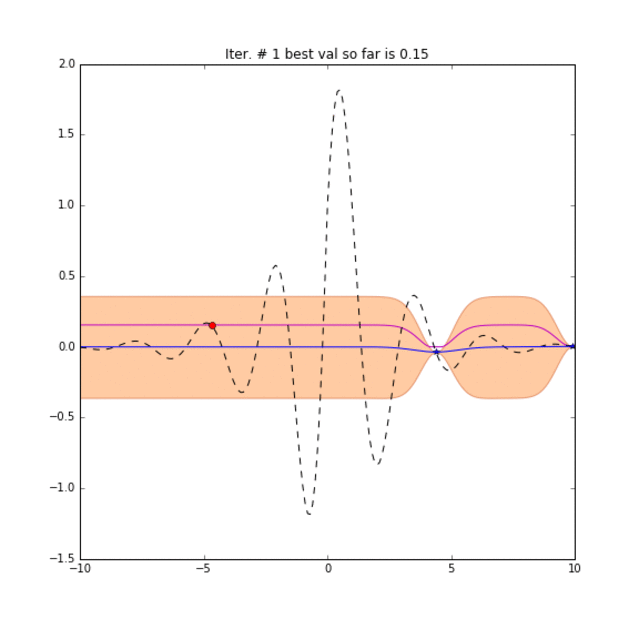
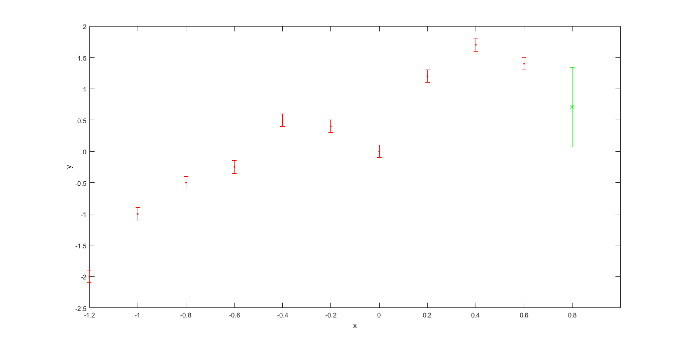
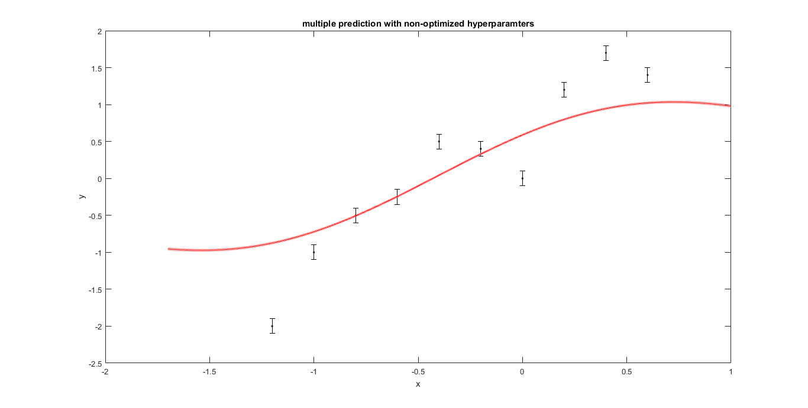
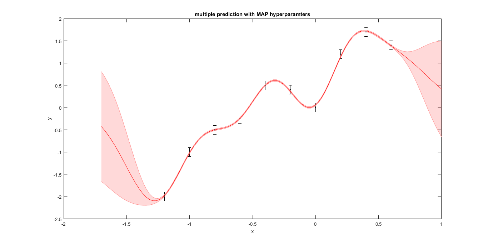
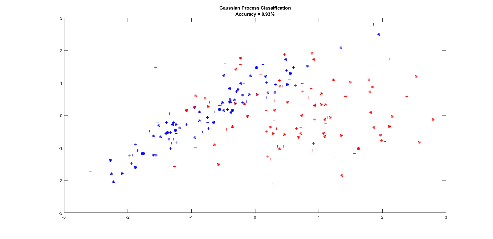
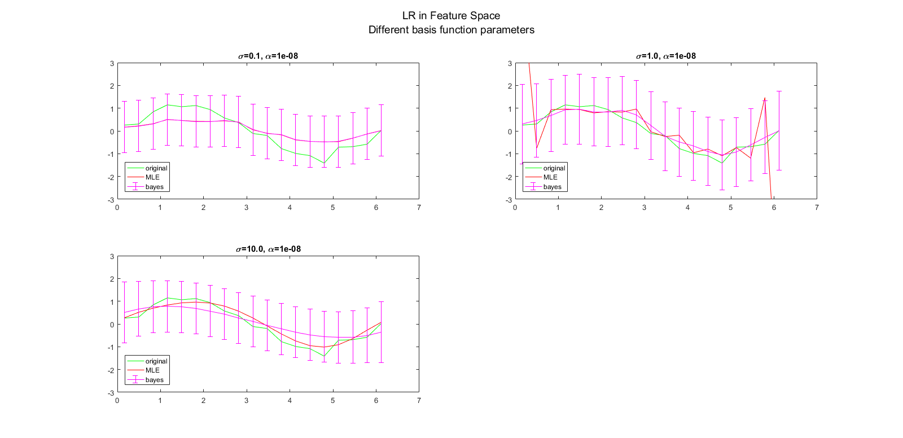
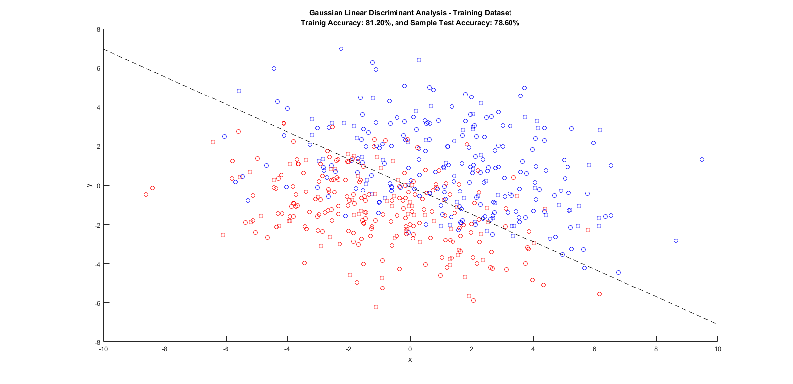
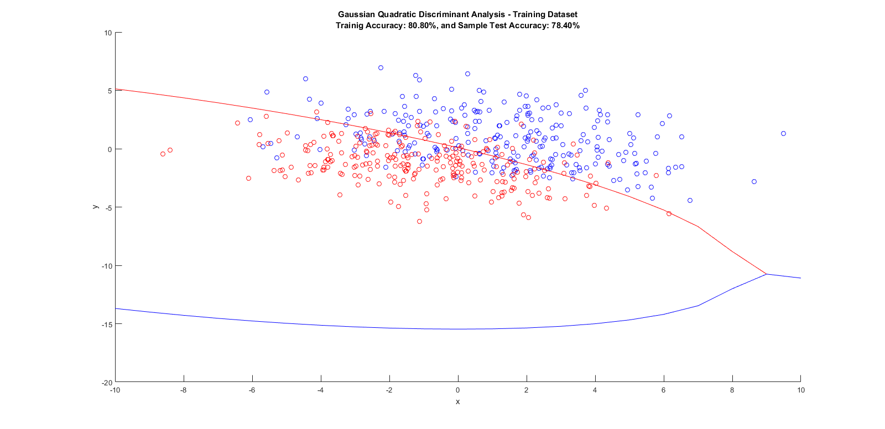
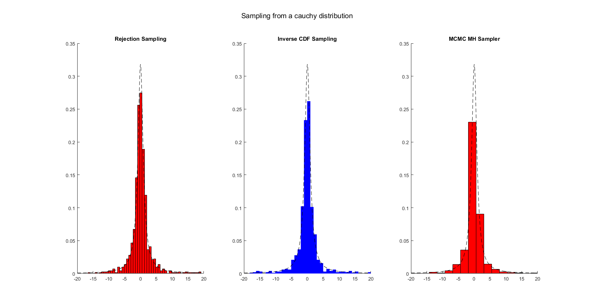
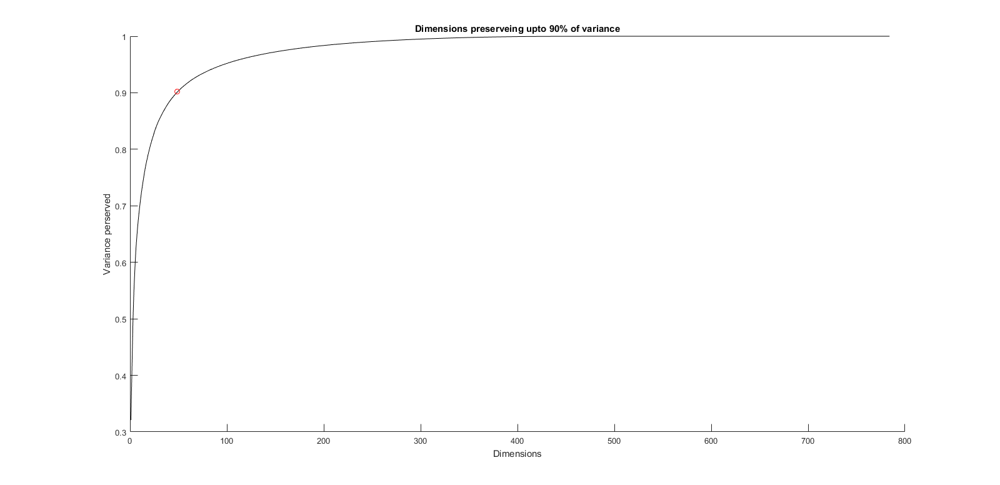

# Some Machine Learning Experiences

## Bayesian Optimization with Gaussian Processes
[**BO in Python**](BayesianOptimization/BayesianOptimization.ipynb)

You will see an example of optimizing a simple Neural Network's Hyperparameters with Bayesian Optimization

Using Expected Improvement acquisition function:

## Gaussian Process Regression and Classification

[**GPR in Python**](GaussianProcesses/GRP.ipynb)
[or in matlab](GaussianProcesses/GPR.m)

[**GPC in Python**](GaussianProcesses/GPC.ipynb)
[or in matlab](GaussianProcesses/GPC.m)

### Regression with Gaussian Processes
We have noisy sensor readings (indicated by errorbars).
first we will do a point prediction:

Next we will predict 100 points

And we finally use MAP estimate of the hyperparameters:

### Classification with Gaussian Processes
We have generated training points and labels and then tried to compute labels for test points.
Each + is one trainig point and * is a test point:

If the color of '*' and 'o' coincide then that point is correctly classified. The points without any circle around them are training points ('+').

## Linear Regression (LR) and Classification (LC)

### LR in high-dimensional feature space

[matlab code](LinearRegression/main.m)

Here have projected input to a hd feature space with the help of basis functions and followed the rest of the standard linear model for regression. We see effect of different choices for basis function hyperparameters.

### LC with Linear and Quadratic Decision Boundaries

[matlab code](LinearClassification/linearclassification.m)

## Sampling Techinques

### Sampling from a cauchy distribution

[matlab code](Sampling/cauchysampling.m)

## Principle Component Analysis

### Basics of PCA

[matlab code](PrincipleComponentAnalysis/pca_basics.m)

in the folder you can also find code for PCA with isotropic noise.

